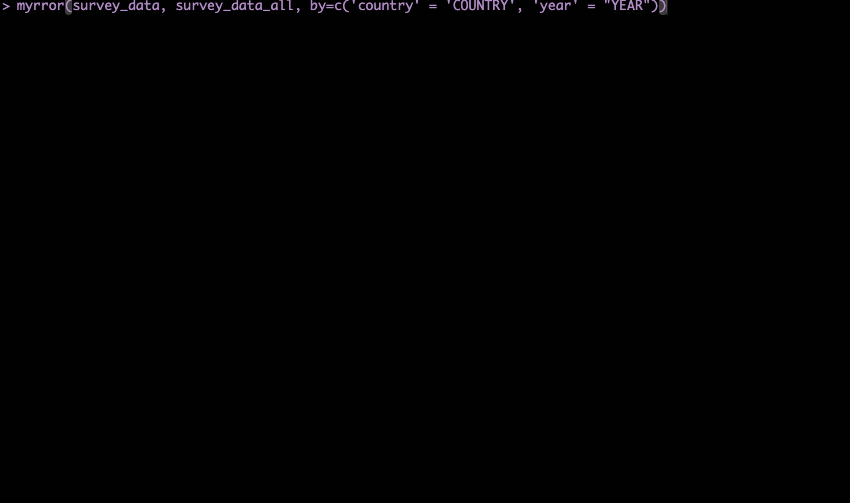
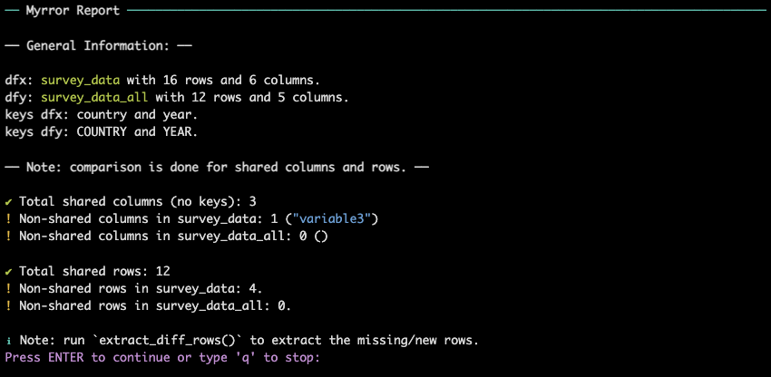
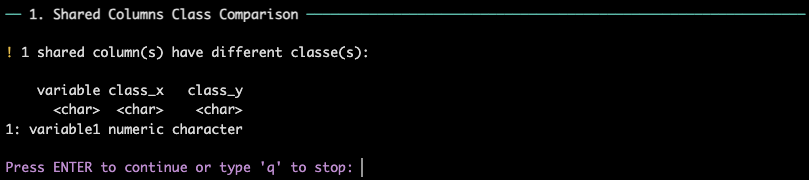
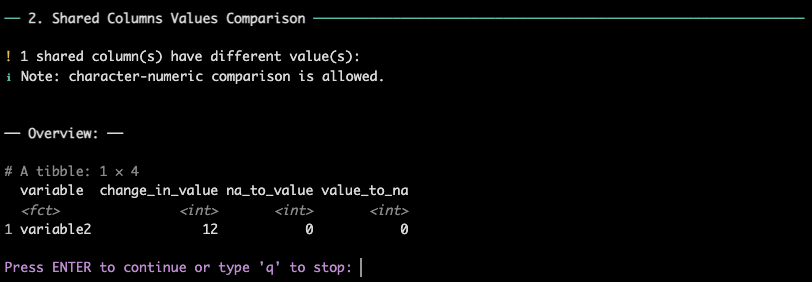
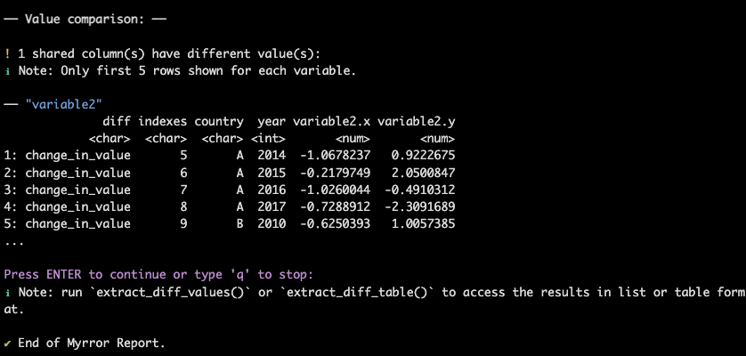
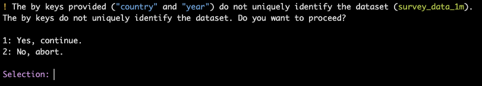
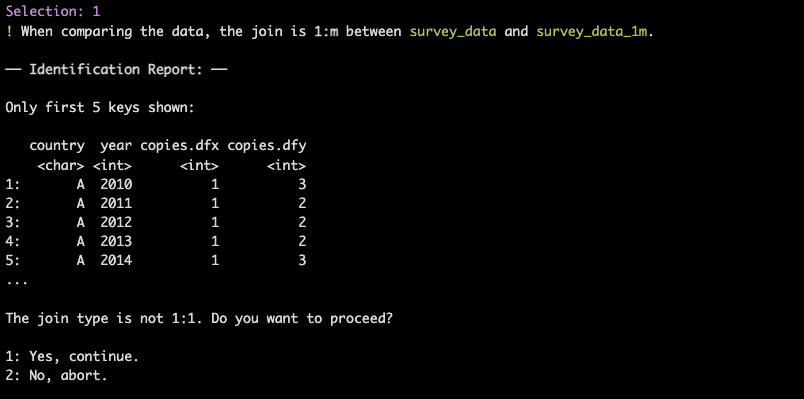

# Myrror Overview

``` r
library(myrror)
```

## Introduction

In this article we give a complete overview of the function
[`myrror()`](https://PIP-Technical-Team.github.io/myrror/reference/myrror.md).
We will go through the main steps of the comparison, and show how to use
the auxiliary functions to extract differences between two data frames.
In the first example, we will look at the case where both datasets are
**identified**: this means that the user has supplied a set of keys to
align the rows of the two data frames. In the second example, we will
look at the case where the datasets are **not identified**: this means
that the user-supplied keys do not uniquely identify the rows of the two
data frames.

## Identified Data

For the first comparison, we will use the `survey_data` and
`survey_data_all` datasets. `survey_data_all` is a variation of
`survey_data` which contains all possible issues that can arise during
the comparison: differences in values, a variable with a change in
class, a different number of columns, and a different number of rows.
Additionally, the two datasets have different keys names, which can be
supplied to the function like so:

``` r
myrror(survey_data, survey_data_all, by = c('country' = "COUNTRY", "year" = "YEAR"),
       interactive = TRUE)
```

When running the function in interactive mode, the user will fo through
this screen:



### General Overview

The first part of a
[`myrror()`](https://PIP-Technical-Team.github.io/myrror/reference/myrror.md)
report shows the general characteristics of the two dataframes,
including the number of rows and columns, the keys used for the
comparison (`by` argument) , whether there are missing rows or columns,
and if so, their number and name:

 At the end of the general
overview, a ℹ️ **Note** suggests to the user to run
[`extract_diff_rows()`](https://PIP-Technical-Team.github.io/myrror/reference/extract_diff_rows.md)
to see the differences in the number of rows. More on this function in
the article [Extract Different
Rows](https://PIP-Technical-Team.github.io/myrror/articles/extract_diff_rows.md).

### Compare Type

The second part of the report shows whether there are columns with
different types:



### Compare Values

Next, the report shows the differences in values between the two data
frames. The user can see a summary of how many values are different for
each variable, and which type of difference is present (change in value,
value to NA, or NA to value):


### Extract Differences

Finally, user can have a better look at the differences variable by
variable:  As suggested by the
ℹ️ Note, the user can run
[`extract_diff_values()`](https://PIP-Technical-Team.github.io/myrror/reference/extract_diff_values.md)/`extract_diff_table`
to see the differences in list or table format. More on these functions
in the articles [Extract Different
Values](https://PIP-Technical-Team.github.io/myrror/articles/extract_diff_values.md).

## Non-Identified Data

For the second comparison, we will use the `survey_data` and
`survey_data_1m` datasets. `survey_data_1m` is a variation of
`survey_data` in which the keys `country` and `year` do not uniquely
identify the rows of the two data frames.

The user will be warned about this issue and asked whether to proceed
with the comparison:

### Warning 1: not identified.

If one of the two data frames is not identified, the user will be warned
about this issue:

 The warning will be repeated if both
data frames are not identified.

### Warning 2: 1:m match.

If the user decides to proceed with the comparison,
[`myrror()`](https://PIP-Technical-Team.github.io/myrror/reference/myrror.md)
goes through the second check. If the match between `dfx` and `dfy` is
**not 1:1** (either 1:m or m:1), the user will be warned about this
issue:



Note that if the match is **m:m**, comparison will be aborted by
default. After this series of warnings, the comparison proceeds as
before. Again, we want to re-iterate that in the case of non-identified
datasets, the comparison is done by row number (`rn`). This means that
*row alignment is based on position within the dataset*, not on the
content of the row, which might result in
[`myrror()`](https://PIP-Technical-Team.github.io/myrror/reference/myrror.md)
reporting more discrepancies than if the rows were aligned based on row
content. This is also why we always suggest the user to provide keys, if
possible.
