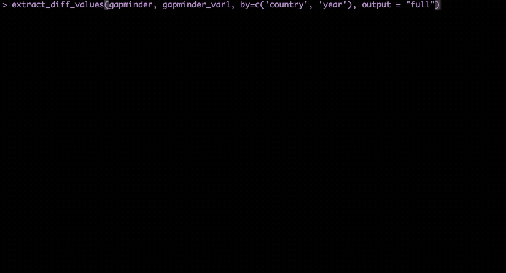

```{r, include = FALSE}
knitr::opts_chunk$set(
  collapse = TRUE,
  comment = "#>"
)
```

```{r setup, include = FALSE}
library(myrror)
library(tidyverse)
library(gapminder)
library(DT)
```

This article looks at a series of workflows for the function `extract_diff_values()` and its companion `extract_diff_table()`.

## Introduction

At its core, both functions do the following:

1.  Set up the two data frames (`dfx` and `dfy`) for comparison:
    -   Pair rows based on the keys provided (given by the user using the `by` , `by.x`, `by.y` arguments, or by row number).
    -   Pair columns based on the column names.
2.  Run the comparison between shared rows and shared columns only.
3.  Then depending on the function:
    -   `extract_diff_values()`: returns a list of `data.table`s, one per variable, with the values of a given variable in `dfx` and `dfy` side-by-side.
    -   `extract_diff_table()`: returns a `data.table` with all differences in values between `dfx` and `dfy`.

In this article, we will first cover how `extract_diff_values()` work with a simple and then a more complex type of data set. Then, we will look at how `extract_diff_table()` can add value to the comparison.

::: {.callout-important}
### ⚠️ No keys provided

Right now, `{myrror}` does not align rows based on row content. This means that if the user does not provide keys, the function will compare the two datasets based on row number only. This can lead to incorrect results (`extract_diff_values()` will not return the correct rows) if:

-   the datasets have different row orders.

-   a detaset have duplicate rows.

-   a dataset has new/missing rows.

Therefore, we suggest the user to **always provide keys** when running this and the other functions.
:::

## Example 1: one variable with differences.

If you run the functions with arguments `output = "full"` the console will print a user-friendly summary of the comparison, similar to the output of `myrror()`, but displaying only the output of `extract_diff_values()`.


When run in default mode, with `output = "simple"` , `extract_diff_values()` returns a list of `data.table`s:

```{r example-one}
output <- extract_diff_values(survey_data, survey_data_2, by=c('country', 'year'), output = "simple")
print(output)
```

In this comparison, `survey_data` and `survey_data_2` are two data frames that differ in the values of the `variable2` column. The output shows the values of the variable `variable2` in survey_data (`dfx`) as `variable2.x` and in survey_data_2 (`dfy`) as `variable2.y`. The column `diff` identifies the type of differences between the two values. In this case, in `survey_data`, the non-matching observations have different values. Therefore, the column `diff` shows `change_in_value`.

This output can be manipulated by the user to explore the differences in more detail.

## Example 2: multiple variables with differences.

Here is a case where the two data frames differ in multiple variables:

```{r example-two-str}
survey_data_2$variable2[c(1,2,3,4)] <- NA
survey_data_2$variable3 <- NA
output <- extract_diff_values(survey_data, survey_data_2, by=c('country', 'year'), output = "simple")
str(output, max.level = 1)
```

This time, the object returned is a list of `data.table`s, one for each variable that differs between the two data frames. If we look into one single variable, we can see that there are also different types of differences, in this case `value_to_na` and `change_in_value`:

```{r example-two-group}
output$variable2 |>
  group_by(diff)|>
  count()
```

Let's assume that I want to focus on missing values in the variable `variable2`:

```{r example-two-filter}
output$variable2 |>
  filter(diff == "value_to_na")
```

The user can use the indexes to extract the observations in `dfy`:

```{r example-two-index}
indexes <- output$variable2 |>
  filter(diff == "value_to_na") |>
  select(indexes)|>
  mutate(indexes = as.numeric(indexes))

survey_data_2[c(indexes$indexes), ]
```

## Example 3: a larger dataset

In this example we will look at a more complex case, using the publicly available `gapminder` dataset. We will compare the `gapminder` dataset with a modified version of it, `gapminder_var1`:

```{r example-three-data}
gapminder_var1 <- gapminder |>
  mutate(lifeExp = ifelse(year == 2007, NA, lifeExp), # NAs in lifeExp for one year
         pop = ifelse(country == 'Italy'& year >= 1992, pop + runif(1,1, 10), pop), # Errors in pop
         gdpPercap = ifelse(country == 'Colombia', gdpPercap/10, gdpPercap)) # Errors in gdpPercap
```

If we run `extract_diff_values()` with the `output = "full"` and `interactive = TRUE` arguments, we will get a full report of the comparison. Note that this time, the two data sets are compared using the unique identifiers `country` and `year`, which will be displayed next to the `indexes` in the extracted rows:

 Alternatively, if we run the function with `output = "simple"` we will get a list of `data.table`s, one per variable that differs between the two data frames:

```{r example-three-simple}
output <- extract_diff_values(gapminder, gapminder_var1, by=c('country', 'year'), output = "simple")
str(output, max.level = 2)

```

From printing the structure of the output, we can see that there are differences in 3 variables: `lifeExp`, `pop`, and `gdpPercap`. The user can explore the differences in more detail by looking at each variable:

`lifeExp` has differences in the values only for the year 2007, where all values are NAs:

```{r example-three-life}
output$lifeExp |>
  group_by(diff, year)|>
  count()
```

`pop` has differences in the values for the country `Italy` and years after 1992, and the difference is a fixed value:

```{r example-three-pop-1}
output$pop |>
  group_by(diff, country, year)|>
  count()
```

```{r example-three-pop-2}
output$pop |>
  mutate(pop_diff = pop.x - pop.y) |>
  select(country, year, pop_diff)
```

Finally, `gdpPercap` has differences in magnitude (10) for `Colombia`. Differences are for all available years, from 1952 to 2007:

```{r example-three-gdp-1}
output$gdpPercap |>
  group_by(diff, country) |>
  count()
```

```{r example-three-gdp-2}
output$gdpPercap |>
  mutate(gdpPercap_ratio = gdpPercap.x/gdpPercap.y)|>
  select(country, year, gdpPercap_ratio)|>
  head()
```

## Extracting the differences in a table format

The function `extract_diff_table()` can be used to extract the differences in a table format. This function is useful when the user wants to see all differences in values between all variables. The output is a `data.table` with all rows (observations) that have at least one difference in a variable. If a row has differences in multiple variables, it will be displayed multiple times, one per difference.

```{r table-1}
extract_diff_table(gapminder, gapminder_var1, by=c('country', 'year')) |>
  datatable(
  filter = 'top',
  rownames = FALSE,
  style = 'auto',
  options = list(
    searching = FALSE,
    paging = TRUE,
    scrollX = TRUE,
    autoWidth = TRUE,
    pageLength = 5
  )
)
```

The user can then filter the table to focus on specific differences, aggregate and summarize the table to understand general patterns, or use the indexes to extract the rows from the original data frame.

For example:

```{r example-table-2}
extract_diff_table(gapminder, gapminder_var1, by=c('country', 'year')) |>
  group_by(diff, country) |>
  count()
```

## Conclusion

As a recap:

-   `extract_diff_values()` /`extract_diff_table()`is a function that allows the user to extract the differences in values between two data frames in list/data.table format.

-   It can be run with `output = "full"` to get a full report of the differences. Interactivity can be switched off by setting `interactive = FALSE`.

-   It can be run with `output = "simple"` to get a list of `data.table`s, one per variable that differs between the two data frames.
